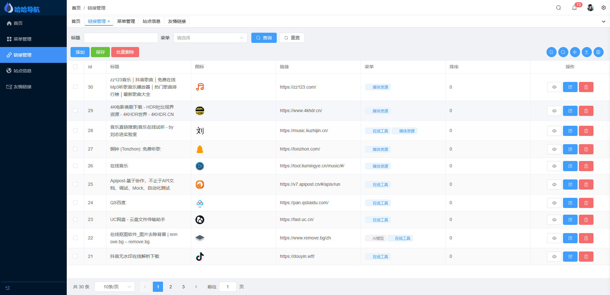

## 哈哈导航
### 开发目的
看上了一为导航的界面，但是需要收费（还不便宜）。六零导航也很喜欢，不过作者目前不打算更新二级菜单和页面描述功能，所有就自己搞一个了。

### 项目截图
#### 前端页面

#### 移动端

#### 后台页面

#### 前后端添加链接时都支持自动爬取网站信息
> 注意：后面颜色选择只对图标起作用

### 目前已实现功能

- 再说吧

### 计划实现功能

- 菜单排序
- 用户登录

